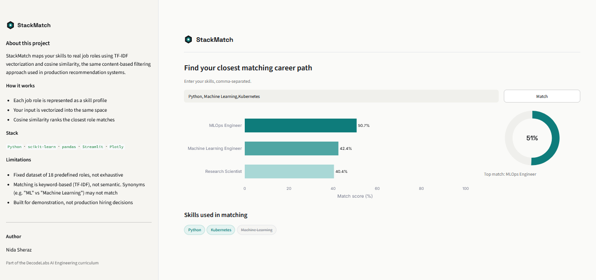

# StackMatch

A skill-based career path recommender that maps a user's skills to the closest matching job roles using TF-IDF vectorization and cosine similarity.




## Overview

StackMatch takes a list of skills as input and recommends the top 3 job roles that most closely match, using the same content-based filtering approach used in production recommendation systems.

## How it works

1. Each job role in the dataset is represented as a "document" — a comma-separated string of required skills.
2. A TF-IDF vectorizer is fit on the entire corpus of job role skill profiles, learning a shared vocabulary and term-weighting scheme.
3. The user's input skills are transformed into the same vector space (not re-fit — this preserves comparability).
4. Cosine similarity is computed between the user's vector and every job role's vector.
5. The top 3 roles by similarity score are returned and ranked.

## Features

- TF-IDF + cosine similarity recommendation engine
- Input validation: handles empty input, duplicate skills, whitespace, and case differences
- Unknown skill detection: flags skills not present in the training vocabulary instead of silently ignoring them
- Interactive Streamlit UI with horizontal bar chart and confidence donut chart (Plotly)
- Custom light theme with consistent typography (Space Grotesk + Inter)

## Tech stack

| Layer | Technology |
|---|---|
| Core logic | Python, scikit-learn (TfidfVectorizer, cosine_similarity) |
| Data handling | pandas |
| UI | Streamlit |
| Visualization | Plotly |

## Project structure

**Project structure**

- `stackmatch/`
  - `data/`
    - `raw_skills.csv` — job_role, skills dataset
  - `src/`
    - `data_loader.py` — dataset loading + validation
    - `recommender.py` — TF-IDF + cosine similarity logic
  - `tests/`
    - `manual_test.py`
  - `assets/`
    - `icon.png`
    - `screenshot.png`
  - `app.py` — Streamlit UI
  - `generate_icon.py`
  - `requirements.txt`

## Running locally

```bash
git clone https://github.com/NidaKhaan/tech-stack-recommender
cd stackmatch
python -m venv venv
venv\Scripts\activate
pip install -r requirements.txt
streamlit run app.py
```

## Limitations

- Fixed dataset of 18 predefined job roles — not exhaustive of the real job market
- Matching is keyword-based (TF-IDF), not semantic — synonyms like "ML" and "Machine Learning" are treated as different tokens unless explicitly present in the dataset vocabulary
- Intended as a demonstration of content-based recommendation, not a production hiring or career-advice tool

## Future improvements

- Replace TF-IDF with sentence embeddings (e.g. `sentence-transformers`) for semantic matching
- Allow multi-select skill input instead of free text
- Expand dataset with real job market data

## Author

Nida Sheraz — part of the DecodeLabs AI Engineering curriculum

